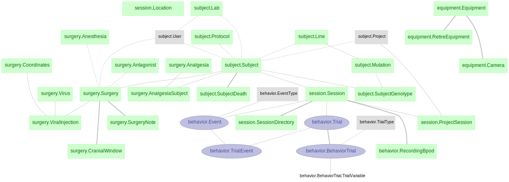
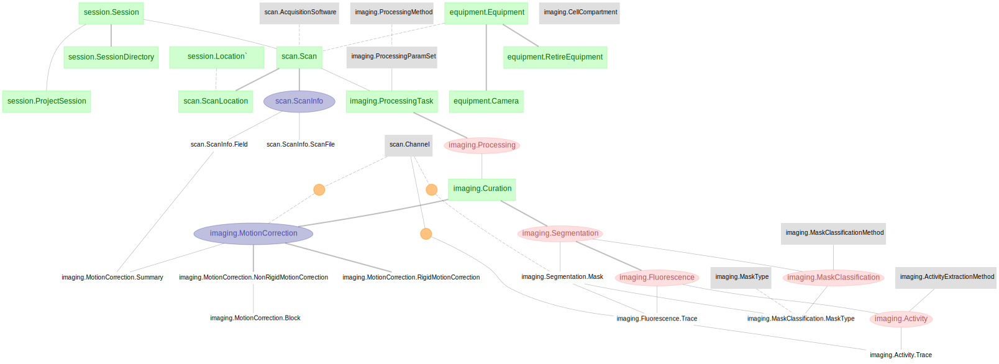

# Architectures for Data Management and Computational Support

This is the central database architecture for the collaborative research center
of the [SFB1089](https://sfb1089.de/). It is based on
[datajoint](https://www.datajoint.org/).

The schemas present are organized as follows:

The above are linked to
[SFB's fork](https://github.com/SFB1089/element-calcium-imaging.git) of DataJoint's
calcium imaging Element:

# Installation
1. Install Anaconda and go to a command prompt.
2. At the command prompot navigate to a directory where you want to download adamacs and type `git clone https://github.com/SFB1089/adamacs.git`
3. Enter the adamacs directory that was created with `cd adamacs`
4. Create an environment called `datajoint` with `conda env create -f environment.yml`
5. Activate the newly created environemnt with `conda activate datajoint`
5. Install adamacs with `pip install .`
6. To get started right away open `jupyter notebook` and open a notebook you want to use.
